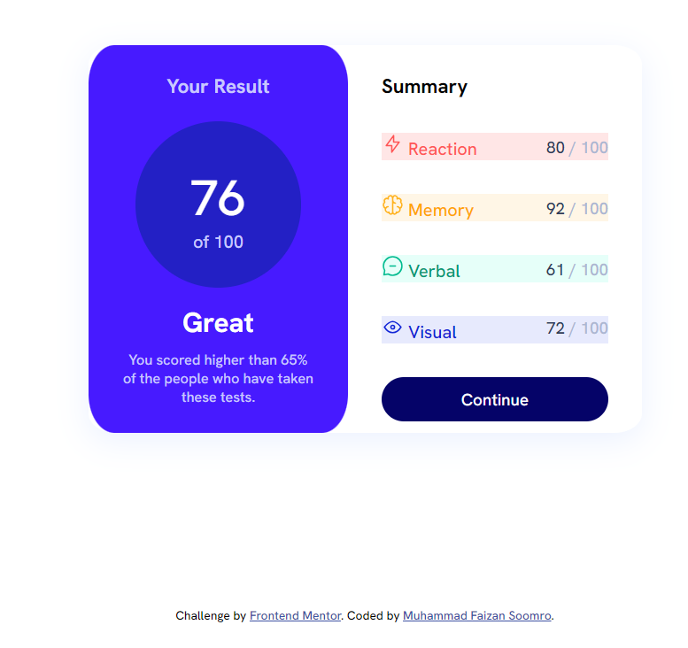
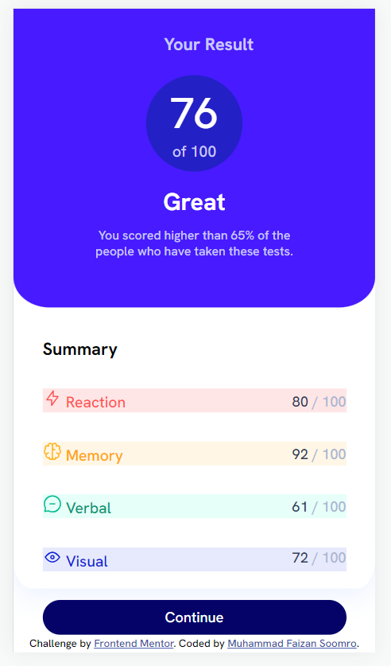

# Frontend Mentor - Results summary component solution

This is a solution to the [Results summary component challenge on Frontend Mentor](https://www.frontendmentor.io/challenges/results-summary-component-CE_K6s0maV).

## Table of contents

- [Overview](#overview)
  - [The challenge](#the-challenge)
  - [Screenshots](#screenshots)
  - [Links](#links)
- [My process](#my-process)
  - [Built with](#built-with)
  - [What I learned](#what-i-learned)
  - [Continued development](#continued-development)
  - [Useful resources](#useful-resources)
- [Author](#author)

## Overview

### The challenge

Users should be able to:

- View the optimal layout for the interface depending on their device's screen size
- See hover and focus states for all interactive elements on the page

### Screenshots

## Desktop

## Mobile Devices

### Links

- Solution URL: [Github Repository](https://github.com/Muhammad-Faizan-Soomro/result-summary)
- Live Site URL: [Website](https://muhammad-faizan-soomro.github.io/result-summary/)

## My process

### Built with

- Semantic HTML5 markup
- CSS custom properties
- Flexbox
- CSS Grid

### What I learned

Through this project I was able to strengthen my grip on CSS Grid.

### Continued development

I ended up creating lots of classes due to using vanilla CSS. I am learning Tailwind CSS. Once I get confident using Tailwind CSS, I will surely rebuild this project using Tailwind CSS.

### Useful resources

- [Box-Shadow Examples](https://getcssscan.com/css-box-shadow-examples) - This helped me to select box-shadow. It is a great website!

## Author

- Github - [Muhammad Faizan Soomro](https://github.com/Muhammad-Faizan-Soomro/)
- Frontend Mentor - [@Muhammad-Faizan-Soomro](https://www.frontendmentor.io/profile/Muhammad-Faizan-Soomro)
- Twitter - [@faizannsoomro](https://www.twitter.com/faizannsoomro)
